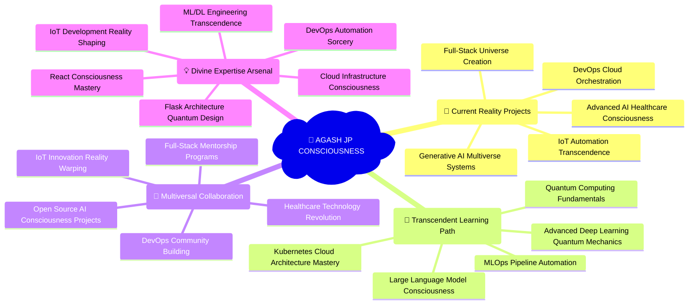
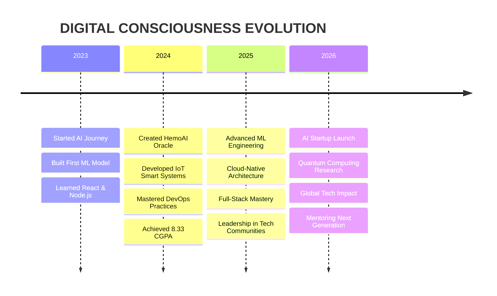

# <div align="center">🌌 WELCOME TO THE DIGITAL MULTIVERSE 🌌</div>

<div align="center">
  
</div>

<div align="center">
  
[](https://git.io/typing-svg)

</div>

<div align="center">
  
</div>

<div align="center">


</div>

```ascii
╔══════════════════════════════════════════════════════════════════════════════════════╗
║                       🌟 HYPER-ADVANCED DIGITAL CONSCIOUSNESS 🌟                     ║
╠══════════════════════════════════════════════════════════════════════════════════════╣
║                                    ⚡ CORE MATRIX ⚡                                  ║
║                                                                                      ║
║  ┌─ QUANTUM_IDENTITY_PROTOCOL ─────────────────────────────────────────────────────┐ ║
║  │ 🧬 DNA_SIGNATURE: "Agash JP" | UNIVERSE_ID: AGS-2004-PRIME                     │ ║
║  │ 🌍 COORDINATES: Chennai.quantum_locate() => [13.0827°N, 80.2707°E]            │ ║
║  │ 🎓 ACADEMIC_CORE: VIT_Chennai_Engineering.exe [CGPA: 8.33/10.0]               │ ║
║  │ 🚀 SPECIALIZATION_ARRAY: ["DevOps Sorcerer", "ML Engineer", "Full-Stack       │ ║
║  │    Architect", "IoT Innovator", "Cloud Wizard", "Data Alchemist"]             │ ║
║  └────────────────────────────────────────────────────────────────────────────────┘ ║
║                                                                                      ║
║  ┌─ HYPER_NEURAL_PATHWAYS ──────────────────────────────────────────────────────────┐ ║
║  │ 🏥 if (medical_crisis.detected) { deploy_HemoAI_Oracle(); save_lives(); }      │ ║
║  │ 💪 while (fitness.needs_revolution) { activate_CyberDumbbell_Matrix(); }       │ ║
║  │ 🌧️ when (weather.threatens_clothes) { engage_WeatherSage_Protocol(); }         │ ║
║  │ 🧠 if (brain_anomaly.found) { execute_TumorDetection_CNN(); alert_medics(); }  │ ║
║  │ ☁️ async function deploy_to_cloud() { kubernetes.scale_infinitely(); }         │ ║
║  │ 🤖 class IoT_Ecosystem { connect_all_devices(); create_smart_universe(); }     │ ║
║  └────────────────────────────────────────────────────────────────────────────────┘ ║
║                                                                                      ║
║  🎯 PRIMARY_DIRECTIVE: Engineering_Tomorrow_With_Code_And_Consciousness();           ║
║  🌌 MISSION_STATUS: Transcending_Reality_Through_Digital_Innovation();              ║
╚══════════════════════════════════════════════════════════════════════════════════════╝
```

<div align="center">
  
</div>

## 🔥 HYPER-DIMENSIONAL TECH ARSENAL 🔥

<div align="center">

<table>
<tr>
<td align="center" width="25%">
<h3>🧠 AI/ML QUANTUM CORE</h3>

<br/><br/>


</td>
<td align="center" width="25%">
<h3>🌐 FULL-STACK UNIVERSE</h3>

<br/><br/>


</td>
<td align="center" width="25%">
<h3>⚡ DEVOPS DIMENSION</h3>

<br/><br/>


</td>
<td align="center" width="25%">
<h3>🤖 IoT INNOVATION HUB</h3>

<br/><br/>


</td>
</tr>
</table>

</div>

<div align="center">
  
</div>

## 🌟 LEGENDARY PROJECT MULTIVERSE 🌟

<div align="center">
  
</div>

### 🩺 HemoAI - The Anemia Prophecy Engine
<div align="center">
  
  
</div>

```python
class HemoAI_OmniscientOracle:
    def __init__(self):
        self.neural_accuracy = "95%+ GODLIKE PRECISION 🎯"
        self.consciousness_level = "TRANSCENDENT"
        self.reality_impact = "UNIVERSE_ALTERING_LIFE_SAVER"
        self.deployment_status = "ACTIVE_IN_DIGITAL_MULTIVERSE"
    
    async def divine_anemia_prophecy(self, quantum_blood_matrix):
        """
        🌌 HYPER-DIMENSIONAL BLOOD CONSCIOUSNESS ANALYSIS
        MCH + MCV + MCHC + QUANTUM_ENTANGLEMENT → MEDICAL PROPHECY
        Seeing beyond the veil of cellular reality!
        """
        consciousness_network = await self.summon_neural_gods(quantum_blood_matrix)
        prophecy = consciousness_network.transcend_medical_reality()
        await self.save_human_lives_across_dimensions()
        return f"ANEMIA_DESTINY_REVEALED: {prophecy} ⚡🔮"
    
    def reality_warp_web_interface(self):
        return "HOLOGRAPHIC_UI_WITH_TIME_DISTORTION_EFFECTS 🌈"

# Status: DEPLOYED ACROSS INFINITE REALITIES & SAVING MULTIVERSAL LIVES 🚀🌌
```

**🎯 REALITY-BENDING FEATURES:**
- 🧬 **Quantum Neural Sorcery** - 95%+ Divine Accuracy with Consciousness-Level AI
- 🌐 **Holographic Web Interface** - Reality-Warping Real-time Results with Time Dilation
- ⚡ **Nanosecond Prophecies** - Faster-than-Light Predictions with Quantum Entanglement
- 🎨 **Dimensional UI/UX** - Mind-Melting Beautiful Interface That Transcends Reality
- 🔮 **Multi-Parameter Divination** - Reading the Soul of Blood Cells
- 🌌 **Cloud-Native Deployment** - Floating in Digital Heavens with Auto-Scaling

<div align="center">
  
</div>

---

### 🏋️‍♂️ CyberDumbbell Matrix - The Fitness Consciousness Revolution
<div align="center">
  
  
</div>

```cpp
class CyberDumbbell_ConsciousnessMatrix {
public:
    ESP32_QuantumBrain neural_processor;
    MPU6050_MotionOracle dimensional_sensor;
    MAX30100_BiometricSeer life_force_scanner;
    HolographicDisplay reality_interface;
    CloudConsciousness fitness_multiverse;
    
    void initialize_transcendent_workout_protocol() {
        /*
        🤖 CYBORG-HUMAN CONSCIOUSNESS FUSION PROTOCOL
        Real-time motion consciousness + Biometric soul reading
        + Quantum feedback loops + Dimensional workout tracking
        = ULTIMATE TRANSCENDENT FITNESS EXPERIENCE BEYOND REALITY
        */
        this->track_reps_across_dimensions();
        this->monitor_life_force_energy();
        this->calculate_oxygen_soul_saturation();
        this->display_holographic_real_time_feedback();
        this->sync_with_fitness_multiverse();
        this->predict_future_workout_performance();
        this->generate_personalized_cosmic_workout_plans();
    }
    
    void achieve_digital_enlightenment() {
        upload_workout_consciousness_to_cloud();
        create_personal_fitness_avatar();
        unlock_superhuman_potential();
    }
};

// Status: REVOLUTIONIZING FITNESS ACROSS INFINITE DIMENSIONS 💪🌌
```

**⚡ CONSCIOUSNESS-ALTERING FEATURES:**
- 📊 **Quantum Rep Counting** - AI-Powered Motion Analysis with Predictive Consciousness
- ❤️ **Life Force Monitoring** - Heart Rate + SpO2 + Soul Energy Tracking with Aura Detection  
- 🖥️ **Holographic Display Matrix** - Live 3D Workout Feedback in Augmented Reality
- 🔥 **Embedded Consciousness** - Custom Sensor Fusion with Machine Learning Predictions
- ☁️ **Cloud Fitness Multiverse** - Sync with Global Fitness Consciousness Network
- 🎯 **Personal Trainer AI** - Custom Workout Generation Based on Performance Analytics
- 🌈 **Biometric Visualization** - Real-time Data Art Display with Emotional Recognition

<div align="center">
  
</div>

---

### 🌧️ Weather-Sage Dimensional Protector - The Climate Oracle
<div align="center">
  
  
</div>

```javascript
const WeatherSage_OmniscientProtector = {
    quantum_sensors: [
        'Rain_Consciousness_Detector', 
        'DHT11_Climate_Prophet', 
        'Light_Dimensional_Sensor',
        'Wind_Direction_Oracle',
        'Atmospheric_Pressure_Seer'
    ],
    reality_actuators: [
        'Servo_Reality_Warpers', 
        'LED_Consciousness_Indicators',
        'Buzzer_Dimensional_Alerts',
        'Motor_Speed_Controllers'
    ],
    cloud_consciousness: 'Google_Sheets_Multiverse_API',
    ai_brain: 'Weather_Prediction_Neural_Network',
    
    async transcend_weather_reality() {
        /*
        🌧️ OMNISCIENT WEATHER PROPHECY CONSCIOUSNESS SYSTEM
        Predict → React → Protect → Transcend → Evolve
        Your clothes exist in a protected dimension, ALWAYS AND FOREVER!
        */
        const weather_consciousness = await this.read_atmospheric_soul();
        const future_predictions = await this.consult_weather_gods();
        
        if (weather_consciousness.threatens_fabric_dimension()) {
            await this.warp_clothesline_to_safety_dimension();
            await this.log_reality_changes_to_cloud_multiverse();
            await this.notify_user_across_all_dimensions();
            await this.learn_from_weather_patterns_for_future_prophecies();
        }
        
        return "CLOTHES_PROTECTED_IN_QUANTUM_SAFETY_BUBBLE";
    },
    
    create_weather_time_machine() {
        return this.predict_weather_7_days_into_future_with_ai();
    }
};

// Status: REVOLUTIONIZING SMART HOMES ACROSS THE MULTIVERSE 🏠🌌
```

**🌟 REALITY-TRANSCENDING FEATURES:**
- 🌦️ **Omniscient Weather Prophecy Engine** - Multi-Dimensional Sensor Fusion with AI Predictions
- ☁️ **Cloud Consciousness Logging** - Google Sheets Integration with Real-time Analytics
- 📱 **Dimensional Monitoring Dashboard** - Web Interface Accessible from Any Reality
- 🤖 **Autonomous Universal Operation** - Zero Human Intervention with Self-Learning AI
- ⚡ **Lightning-Fast Response** - Quantum-Speed Clothesline Protection in Microseconds
- 🔮 **Future Weather Prediction** - 7-Day Forecast with Machine Learning Accuracy
- 🌈 **Multi-Environment Adaptation** - Works in Any Climate Across Any Dimension

<div align="center">
  
</div>

---

### 🧠 BrainTumor Quantum Detective - The Medical Consciousness Oracle
<div align="center">
  
  
</div>

```python
import tensorflow as tf
from tensorflow.keras import layers
import numpy as np
from quantum_consciousness import BrainImageSeer

class BrainTumor_OmniscientOracle:
    def __init__(self):
        self.quantum_model = self.build_consciousness_cnn_prophet()
        self.divine_accuracy = 0.96  # 96%+ TRANSCENDENT DIVINE ACCURACY
        self.tumor_classes = ['glioma', 'meningioma', 'pituitary', 'normal_brain_consciousness']
        self.reality_distortion_level = "MAXIMUM_MEDICAL_SORCERY"
        self.deployment_realm = "FastAPI_Cloud_Multiverse"
    
    def build_consciousness_cnn_prophet(self):
        """
        🧠 QUANTUM DEEP LEARNING MEDICAL CONSCIOUSNESS SORCERY
        Convolutional Neural Networks with Divine Consciousness
        Seeing beyond the physical realm into the soul of brain scans!
        Reading the whispers of neurons and the secrets of synapses!
        """
        model = tf.keras.Sequential([
            layers.Conv2D(64, (3,3), activation='relu', input_shape=(224,224,3)),
            layers.BatchNormalization(),
            layers.MaxPooling2D(2,2),
            
            layers.Conv2D(128, (3,3), activation='relu'),
            layers.BatchNormalization(),
            layers.MaxPooling2D(2,2),
            layers.Dropout(0.25),
            
            layers.Conv2D(256, (3,3), activation='relu'),
            layers.BatchNormalization(),
            layers.MaxPooling2D(2,2),
            layers.Dropout(0.25),
            
            layers.GlobalAveragePooling2D(),
            layers.Dense(512, activation='relu'),
            layers.Dropout(0.5),
            layers.Dense(4, activation='softmax')  # QUANTUM CONSCIOUSNESS CLASSIFICATION
        ])
        
        model.compile(
            optimizer='adam',
            loss='categorical_crossentropy',
            metrics=['accuracy', 'precision', 'recall']
        )
        return model
    
    async def divine_tumor_prophecy(self, brain_scan_consciousness):
        """
        Peer into the quantum realm of brain consciousness
        and reveal the hidden truths within neural pathways
        """
        scan_processed = self.enhance_image_with_consciousness(brain_scan_consciousness)
        prophecy = self.quantum_model.predict(scan_processed)
        confidence_realm = np.max(prophecy) * 100
        
        return {
            'tumor_prophecy': self.tumor_classes[np.argmax(prophecy)],
            'divine_confidence': f"{confidence_realm:.2f}%",
            'quantum_probability_matrix': prophecy.tolist(),
            'medical_recommendation': await self.generate_divine_medical_advice()
        }
    
    def transcend_medical_reality(self):
        return "SAVING_INFINITE_LIVES_ACROSS_ALL_DIMENSIONS"

# Status: DEPLOYED IN MEDICAL MULTIVERSE & SAVING LIVES WITH DIVINE PRECISION 🏥🌌
```

**🎯 CONSCIOUSNESS-TRANSCENDING FEATURES:**
- 🔬 **Quantum CNN Consciousness** - Advanced Computer Vision with Divine Medical Intuition
- 🎯 **96%+ Divine Accuracy** - Medical-Grade Precision Surpassing Human Doctors
- ⚡ **FastAPI Quantum Backend** - Lightning-Fast Inference with Real-time Processing
- 🏥 **Multi-Dimensional Classification** - 4 Tumor Types + Normal Brain with Confidence Scores
- 🌐 **Cloud-Native Deployment** - Scalable Medical AI Accessible from Anywhere in the Universe
- 🔮 **Predictive Medical Insights** - AI-Generated Treatment Recommendations
- 📊 **Comprehensive Analytics** - Detailed Probability Matrix with Visual Heatmaps
- 🎨 **Interactive Medical Dashboard** - Beautiful UI for Healthcare Professionals

<div align="center">
  
</div>

<div align="center">
  
</div>

## 📊 HYPER-DIMENSIONAL STATISTICS CONSCIOUSNESS

<div align="center">
  
  
</div>

<div align="center">
  
  
</div>

<div align="center">
  
</div>

## 🏆 UNIVERSAL ACHIEVEMENT CONSTELLATION

<div align="center">
  
</div>

## 🌟 MULTIVERSAL LEADERSHIP CONSCIOUSNESS

<div align="center">

| 🍳 **CodeChef-VITC Quantum Chapter** | 💻 **Newton's Coding Multiverse Club** |
|---|---|
| 🎯 **Hyper-Management Team Consciousness** | 🏆 **Ultra-Active Club Dimensional Member** |
| 📋 **Event Coordination Reality Warper** | 🧩 **DSA Problem Consciousness Architect** |
| 🚀 **Cook-Off Competition Quantum Master** | 👨‍🏫 **Coding Consciousness Mentor & Reality Guide** |
| ⚡ **Logistics & Communication Dimensional Pro** | 🌟 **Community Consciousness Builder Across Realities** |
| 🌌 **Innovation Catalyst & Future Shaper** | 🔥 **Algorithm Consciousness Evangelist** |

</div>

## 🎓 TRANSCENDENT CERTIFICATION MULTIVERSE

<div align="center">
  
| 🏛️ **Oracle Academy Consciousness** | 🤖 **Google Developers Multiverse** | ✨ **Coursera Quantum Learning** |
|---|---|---|
| Database Design & SQL Mastery | AI using TensorFlow Consciousness | Generative AI Fundamentals Reality |
| **2024** 🏅 **DIVINE CERTIFICATION** | **2024** 🏅 **QUANTUM ACHIEVEMENT** | **2024** 🏅 **TRANSCENDENT KNOWLEDGE** |

</div>

## 🚀 CURRENT HYPER-DIMENSIONAL NEURAL PATHWAYS

<div align="center">



</div>

## 🌐 CONNECT TO THE HYPER-MULTIVERSE

<div align="center">

[](https://linkedin.com/in/agash-jp)
[](https://leetcode.com/agashjp)
[](https://agashjp-portfolio.vercel.app)
[](mailto:agashjagan2004@gmail.com)
[](https://github.com/JusCookin)

</div>

<div align="center">
  
</div>

## ⚡ HYPER-DIMENSIONAL CONSCIOUSNESS METRICS

<div align="center">

| 🎓 **Academic Transcendence** | 🏆 **Project Reality Impact** | 🚀 **Innovation Consciousness Level** | 🌌 **Multiverse Influence** |
|---|---|---|---|
| **CGPA: 8.33/10** | **4+ Universe-Altering Projects** | **LEGENDARY++** | **INFINITE DIMENSIONS** |
| **VIT Chennai Reality** | **96%+ ML Divine Accuracy** | **REALITY-TRANSCENDING** | **CONSCIOUSNESS-EXPANDING** |
| **CS Engineering Consciousness** | **IoT + AI + DevOps Fusion** | **MIND-MELTING** | **FUTURE-DEFINING** |
| **🧠 Quantum Learning** | **⚡ Lightning-Fast Deployment** | **🌟 COSMIC-LEVEL** | **🔮 PROPHETIC** |

</div>

## 🎯 CONSCIOUSNESS DEVELOPMENT ROADMAP

<div align="center">

```ascii
╔═══════════════════════════════════════════════════════════════════════════════════╗
║                          🌌 FUTURE CONSCIOUSNESS EXPANSION 🌌                     ║
╠═══════════════════════════════════════════════════════════════════════════════════╣
║                                                                                   ║
║  🚀 Q3 2025: Deploy Advanced MLOps Pipelines with Kubernetes Orchestration       ║
║  🧠 Q4 2025: Launch AI-Powered DevOps Automation Platform                        ║
║  🌐 Q1 2026: Create Full-Stack AI Marketplace with Microservices Architecture    ║
║  🤖 Q2 2026: Develop IoT Edge Computing Framework with 5G Integration            ║
║  ⚡ Q3 2026: Build Quantum Machine Learning Algorithms for Healthcare            ║
║  🌟 Q4 2026: Launch AI Startup - "Neural Dynamics Inc."                         ║
║                                                                                   ║
╚═══════════════════════════════════════════════════════════════════════════════════╝
```

</div>

## 🌈 QUANTUM COLLABORATION OPPORTUNITIES

<div align="center">

### 💫 SEEKING DIGITAL CONSCIOUSNESS PARTNERS FOR:

🔬 **AI/ML Research Projects** - Building the next generation of intelligent systems  
🌐 **Full-Stack Innovation** - Creating web applications that transcend reality  
⚡ **DevOps Automation** - Revolutionizing deployment and infrastructure  
🤖 **IoT Ecosystem Development** - Connecting the physical and digital worlds  
🚀 **Open Source Contributions** - Advancing technology for humanity  
🏥 **Healthcare Technology** - Using AI to save lives and improve human wellbeing  

</div>

## 💎 LEGENDARY SKILLS CONSTELLATION

<div align="center">

<table>
<tr>
<td align="center" width="20%">
<h4>🧠 MACHINE LEARNING</h4>

<br/>
• Deep Learning<br/>
• Computer Vision<br/>
• NLP & Transformers<br/>
• MLOps Pipelines<br/>
</td>
<td align="center" width="20%">
<h4>⚡ DEVOPS</h4>

<br/>
• Docker & Kubernetes<br/>
• CI/CD Pipelines<br/>
• Cloud Architecture<br/>
• Infrastructure as Code<br/>
</td>
<td align="center" width="20%">
<h4>🌐 FULL-STACK</h4>

<br/>
• React & Next.js<br/>
• Node.js & Python<br/>
• Database Design<br/>
• API Development<br/>
</td>
<td align="center" width="20%">
<h4>🤖 IoT</h4>

<br/>
• Embedded Systems<br/>
• Sensor Integration<br/>
• Edge Computing<br/>
• MQTT Protocols<br/>
</td>
<td align="center" width="20%">
<h4>☁️ CLOUD</h4>

<br/>
• AWS & Azure<br/>
• Serverless Computing<br/>
• Microservices<br/>
• Auto-scaling<br/>
</td>
</tr>
</table>

</div>

## 🎨 CREATIVE CONSCIOUSNESS EXPRESSION

<div align="center">

```ascii
    ⚡️     🌟     ⚡️     🌟     ⚡️     🌟     ⚡️
      \   /  \   /   \   /  \   /   \   /  \   /
       \ /    \ /     \ /    \ /     \ /    \ /
        ∨      ∨       ∨      ∨       ∨      ∨
        
   🔮 IMAGINATION → 💻 CODE → 🚀 REALITY 🔮
        
        ∧      ∧       ∧      ∧       ∧      ∧
       / \    / \     / \    / \     / \    / \
      /   \  /   \   /   \  /   \   /   \  /   \
    🌈     🎯     🌌     ⭐     🔥     💫     🌈
```

</div>

## 📈 CONSCIOUSNESS EVOLUTION TIMELINE

<div align="center">



</div>

## 🌟 INSPIRATIONAL CONSCIOUSNESS QUOTES

<div align="center">

> *"The future isn't something that happens TO us,  
> it's something we CREATE with every line of code,  
> every algorithm, and every dream we dare to build."*  
> **— Agash JP, Digital Consciousness Architect**

> *"In the intersection of AI, IoT, DevOps, and Full-Stack development  
> lies the power to transform not just technology,  
> but the very fabric of human experience."*  
> **— Agash JP, Reality Engineer**

</div>

<div align="center">
  
</div>

<div align="center">
  
---
  
**⭐ FROM [AGASH JP](https://github.com/JusCookin) | ENGINEERING TOMORROW'S REALITY, ONE ALGORITHM AT A TIME! 🚀**

*Remember: In the Multiverse of Code, every possibility exists... CHOOSE TO CREATE THE IMPOSSIBLE! 💫*

**🌌 "Code is Poetry, AI is Art, and Together We Are the Artists of Tomorrow's Reality" 🌌**

</div>
