# <div align="center">🚀 WELCOME TO THE MATRIX 🚀</div>

<div align="center">
  
</div>

<div align="center">
  
[](https://git.io/typing-svg)

</div>

<div align="center">
  
</div>

<div align="center">


</div>

```ascii
╔══════════════════════════════════════════════════════════════════════════════╗
║                          🌟 NEURAL NETWORK PROFILE 🌟                       ║
╠══════════════════════════════════════════════════════════════════════════════╣
║                                                                              ║
║  ┌─ IDENTITY_MATRIX ─────────────────────────────────────────────────────┐   ║
║  │ NAME: "Agash JP"                                                       │   ║
║  │ LOCATION: Chennai.getCoordinates() => [13.0827°N, 80.2707°E]         │   ║
║  │ STATUS: VIT_Chennai_Student.exe                                        │   ║
║  │ CGPA: 8.33f // Optimized for Excellence                              │   ║
║  │ SPECIALTY: ["AI/ML Architect", "IoT Wizard", "Code Samurai"]         │   ║
║  └────────────────────────────────────────────────────────────────────────┘   ║
║                                                                              ║
║  ┌─ NEURAL_PATHWAYS ──────────────────────────────────────────────────────┐   ║
║  │ if (problem.type === "healthcare") { deployHemoAI(); }                │   ║
║  │ while (fitness.needsTracking) { activateSmartDumbbell(); }           │   ║
║  │ when (weather.isRaining) { triggerAutomatedClothesline(); }          │   ║
║  │ if (brainScan.detected) { runTumorDetectionCNN(); }                  │   ║
║  └────────────────────────────────────────────────────────────────────────┘   ║
║                                                                              ║
║  CURRENT_MISSION: Building_The_Future_One_Algorithm_At_A_Time();             ║
╚══════════════════════════════════════════════════════════════════════════════╝
```

<div align="center">
  
</div>

## 🔥 QUANTUM TECH ARSENAL 🔥

<div align="center">

<table>
<tr>
<td align="center" width="33%">
<h3>🧠 AI/ML NEXUS</h3>

<br/>


</td>
<td align="center" width="33%">
<h3>⚡ FULL-STACK MATRIX</h3>

<br/>


</td>
<td align="center" width="33%">
<h3>🤖 IoT COMMAND CENTER</h3>

<br/>


</td>
</tr>
</table>

</div>

<div align="center">
  
</div>

## 🌟 LEGENDARY PROJECT SHOWCASE 🌟

<div align="center">
  
</div>

### 🩺 HemoAI - The Anemia Oracle
<div align="center">
  
  
</div>

```python
class HemoAI_SystemAnalysis:
    def __init__(self):
        self.accuracy = "90%+ 🎯"
        self.intelligence_level = "GODLIKE"
        self.impact = "LIFE_SAVING"
    
    def predict_anemia(self, blood_params):
        """
        🔬 QUANTUM BLOOD ANALYSIS
        MCH + MCV + MCHC → AI PROPHECY
        """
        neural_network.process(blood_params)
        return "ANEMIA_RISK_CALCULATED ⚡"

# Status: DEPLOYED & SAVING LIVES 🚀
```

**🎯 MIND-BLOWING FEATURES:**
- 🧠 **Neural Network Sorcery** - 90%+ Accuracy Rate
- 🌐 **Real-time Web Interface** - Instant Results
- ⚡ **Lightning-Fast Predictions** - Millisecond Response
- 🎨 **Intuitive UI/UX** - Beautiful & Functional

<div align="center">
  
</div>

---

### 🏋️‍♂️ IoT Smart Dumbbell - The Fitness Prophet
<div align="center">
  
  
</div>

```cpp
class SmartDumbbell_Matrix {
public:
    ESP32 brain;
    MPU6050 motion_sensor;
    MAX30100 biometric_scanner;
    
    void initialize_workout_protocol() {
        /*
        🤖 CYBORG FITNESS INTEGRATION
        Real-time motion tracking + Heart monitoring
        = ULTIMATE WORKOUT EXPERIENCE
        */
        track_reps();
        monitor_heart_rate();
        calculate_spo2();
        display_real_time_feedback();
    }
};

// Status: TRANSFORMING FITNESS INDUSTRY 💪
```

**⚡ REVOLUTIONARY FEATURES:**
- 📊 **Real-time Rep Counting** - AI-Powered Motion Analysis
- ❤️ **Biometric Monitoring** - Heart Rate + SpO2 Tracking  
- 🖥️ **Smart Display Interface** - Live Workout Feedback
- 🔥 **Embedded Intelligence** - Custom Sensor Fusion

<div align="center">
  
</div>

---

### 🌧️ Weather-Responsive Clothesline - The Climate Sage
<div align="center">
  
  
</div>

```javascript
const WeatherSage = {
    sensors: ['Rain_Detector', 'DHT11_Climate', 'Light_Sensor'],
    actuators: ['Servo_Motors', 'LED_Indicators'],
    cloud: 'Google_Sheets_API',
    
    automate_protection() {
        /*
        🌧️ WEATHER PROPHECY SYSTEM
        Predict → React → Protect
        Your clothes stay dry, ALWAYS!
        */
        if (weather.isRaining()) {
            this.retract_clothesline();
            this.log_to_cloud();
            this.notify_user();
        }
    }
};

// Status: REVOLUTIONIZING SMART HOMES 🏠
```

**🌟 FUTURISTIC FEATURES:**
- 🌦️ **Weather Prediction Engine** - Multi-sensor Fusion
- ☁️ **Cloud Data Logging** - Google Sheets Integration
- 📱 **Remote Monitoring** - Web Dashboard Access
- 🤖 **Autonomous Operation** - Zero Human Intervention

<div align="center">
  
</div>

---

### 🧠 Brain Tumor Detection - The Medical Oracle
<div align="center">
  
  
</div>

```python
import tensorflow as tf
from tensorflow.keras import layers

class BrainTumorOracle:
    def __init__(self):
        self.model = self.build_cnn_prophet()
        self.accuracy = 0.90  # 90%+ Divine Accuracy
        self.classes = ['glioma', 'meningioma', 'pituitary', 'normal']
    
    def build_cnn_prophet(self):
        """
        🧠 DEEP LEARNING MEDICAL SORCERY
        Convolutional Neural Networks
        Seeing what human eyes cannot!
        """
        model = tf.keras.Sequential([
            layers.Conv2D(32, (3,3), activation='relu'),
            layers.MaxPooling2D(),
            layers.Conv2D(64, (3,3), activation='relu'),
            # ... More layers of MAGIC
        ])
        return model

# Status: SAVING LIVES WITH AI 🏥
```

**🎯 LIFE-SAVING FEATURES:**
- 🔬 **CNN Deep Learning** - Advanced Computer Vision
- 🎯 **90%+ Accuracy** - Medical-Grade Precision
- ⚡ **FastAPI Backend** - Lightning-Fast Inference
- 🏥 **Multi-class Detection** - 4 Tumor Types + Normal

<div align="center">
  
</div>

<div align="center">
  
</div>

## 📊 QUANTUM STATISTICS MATRIX

<div align="center">
  
  
</div>

<div align="center">
  
  
</div>

<div align="center">
  
</div>

## 🏆 ACHIEVEMENT CONSTELLATION

<div align="center">
  
</div>

## 🌟 LEADERSHIP MATRIX

<div align="center">

| 🍳 **CodeChef-VITC Chapter** | 💻 **Newton's Coding Club** |
|---|---|
| 🎯 **Management Team Member** | 🏆 **Active Club Member** |
| 📋 **Event Coordination Wizard** | 🧩 **DSA Problem Architect** |
| 🚀 **Cook-Off Competition Master** | 👨‍🏫 **Coding Mentor & Guide** |
| ⚡ **Logistics & Communication Pro** | 🌟 **Community Builder** |

</div>

## 🎓 CERTIFICATION VAULT

<div align="center">
  
| 🏛️ **Oracle Academy** | 🤖 **Google Developers** | ✨ **Coursera** |
|---|---|---|
| Database Design & SQL | AI using TensorFlow | Generative AI Fundamentals |
| **2024** 🏅 | **2024** 🏅 | **2024** 🏅 |

</div>

## 🚀 CURRENT NEURAL PATHWAYS

```mermaid
mindmap
  root)AGASH JP(
    (🔬 Current Projects)
      Advanced AI Healthcare
      Generative AI Systems
      IoT Automation
    (🌱 Learning Path)
      Large Language Models
      Advanced Deep Learning
      Cloud Architecture
    (👯 Collaboration)
      Open Source AI
      IoT Innovations
      Healthcare Tech
    (💡 Expertise)
      React Mastery
      Flask Architecture  
      ML/DL Engineering
      IoT Development
```

<div align="center">



</div>

## 🌐 CONNECT TO THE MATRIX

<div align="center">

[](https://linkedin.com/in/agash-jp)
[](https://leetcode.com/agashjp)
[](https://agashjp-portfolio.vercel.app)
[](mailto:agashjagan2004@gmail.com)

</div>

<div align="center">
  
</div>

## ⚡ QUANTUM METRICS

<div align="center">

| 🎓 **Academic Excellence** | 🏆 **Project Impact** | 🚀 **Innovation Level** |
|---|---|---|
| **CGPA: 8.33/10** | **4+ Major Projects** | **LEGENDARY** |
| **VIT Chennai** | **90%+ ML Accuracy** | **FUTURISTIC** |
| **CS Engineering** | **IoT + AI Fusion** | **MIND-BLOWING** |

</div>

## 🎯 MATRIX PHILOSOPHY

<div align="center">

```ascii
╔═══════════════════════════════════════════════════════════════╗
║                                                               ║
║  "The future belongs to those who blend                       ║
║   ARTIFICIAL INTELLIGENCE with HUMAN CREATIVITY               ║
║   to solve REAL-WORLD PROBLEMS"                              ║
║                                                               ║
║                           - Agash JP                          ║
║                                                               ║
╚═══════════════════════════════════════════════════════════════╝
```

</div>

<div align="center">
  
</div>

<div align="center">
  
---
  
**⭐ FROM [AGASH JP](https://github.com/JusCookin) | BUILDING THE FUTURE, ONE ALGORITHM AT A TIME! 🚀**

*Remember: In the Matrix of Code, there are no limits... only POSSIBILITIES! 💫*

</div>
